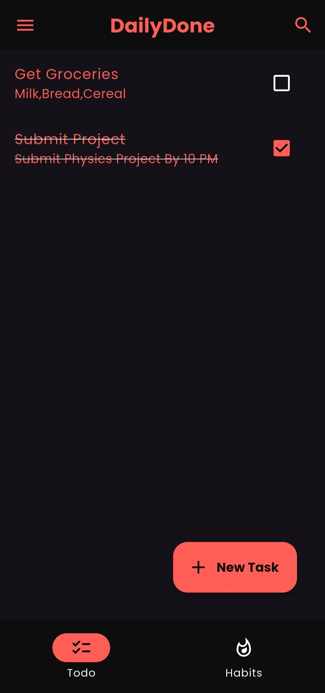
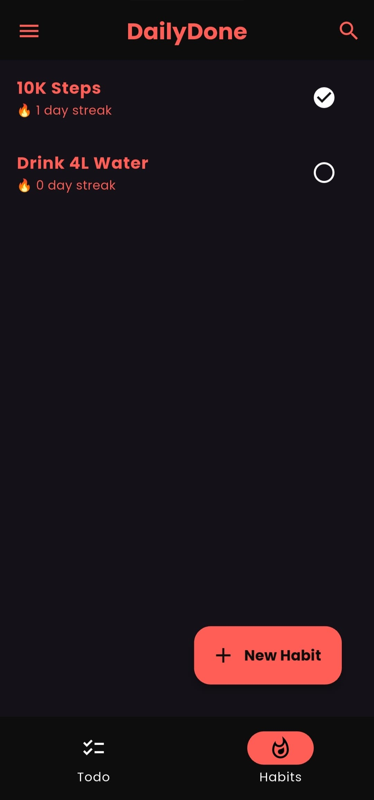
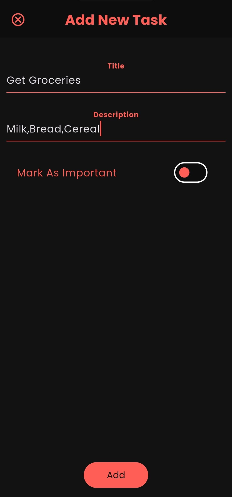
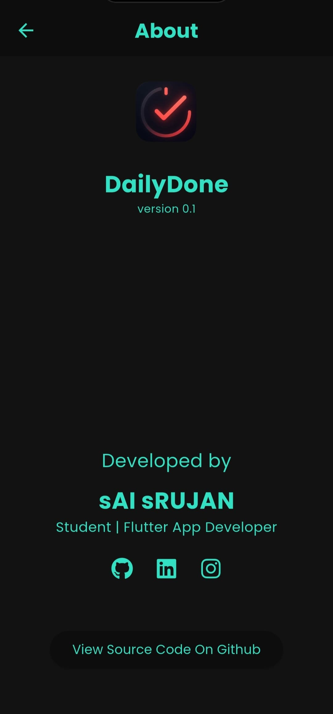
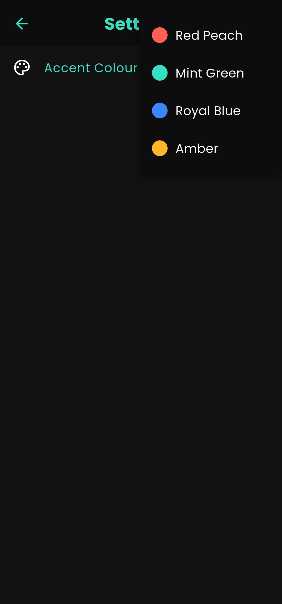

# 📝 DailyDone

**DailyDone** is a modern, minimalistic **habit & task tracker** built entirely with Flutter.  
Track habits, organize your to-dos, and build consistency — all within a sleek, dark-themed interface.

> 🚧 Built completely from scratch in just 10 days — no tutorials, no code copying — just pure problem-solving and UI crafting.  
> Proudly created as a solo developer project by **sAI sRUJAN**.

## Screenshots

---

## 🚀 Features – v0.1 MVP

- ✅ Add, complete, and delete todo tasks
- 🔁 Habit tracker with daily check-ins and automatic streak calculation
- 🎨 Dark UI with customizable accent color
- 📦 Local data persistence using Hive (offline-first)
- 📋 Empty state visuals and snackbar feedback
- 🎯 Long-press to delete habits
- ℹ️ Includes an About page
- 🔒 No login or internet required

---

## 🧩 Tech Stack

| Tool | Description |
|------|-------------|
| **Flutter** | Cross-platform app development |
| **Hive** | Lightweight NoSQL local database |
| **Shared Preferences** | Persistent theme settings |
| **IndexedDB** | Used by Hive on web for persistent browser storage |

---

## 💻 Platforms & Downloads

| Platform     | Build Type       | Download |
|--------------|------------------|----------|
| **📱 Android**  | APK Release       | [Download APK](https://github.com/saiusesgithub/DailyDone/releases/latest) |
| **🌐 Web**      | GitHub Pages      | [Try it Online](https://saiusesgithub.github.io/DailyDone_Web) |
| **🖥️ Windows**  | Standalone EXE (ZIP) | [Download EXE](https://github.com/saiusesgithub/DailyDone/releases/latest) |

---

## 🗺️ Roadmap

Planned features & upcoming releases → [ROADMAP.md](ROADMAP.md)

Some ideas in the pipeline:
- 🔔 Notification reminders
- 📊 Weekly habit analytics
- 🧠 Smart streak recovery
- 🧩 Category-wise task filters
- 🔒 PIN/biometric lock

---

## 📤 Publishing & Hosting

- ✅ Releases are available under the [Releases section](https://github.com/yourusername/DailyDone/releases)
- ✅ Web version is hosted via GitHub Pages for instant browser access

---

## 👨‍💻 Creator

Built with ❤️ by **Sai Srujan**  
🔗 [GitHub Profile](https://github.com/saiusesgithub)

> Feedback, feature ideas, or collaboration? Feel free to open an issue or drop a star ⭐

---

## 🪪 License

This project is licensed under the **MIT License** – open-source, free to use, and contribute to.

---
